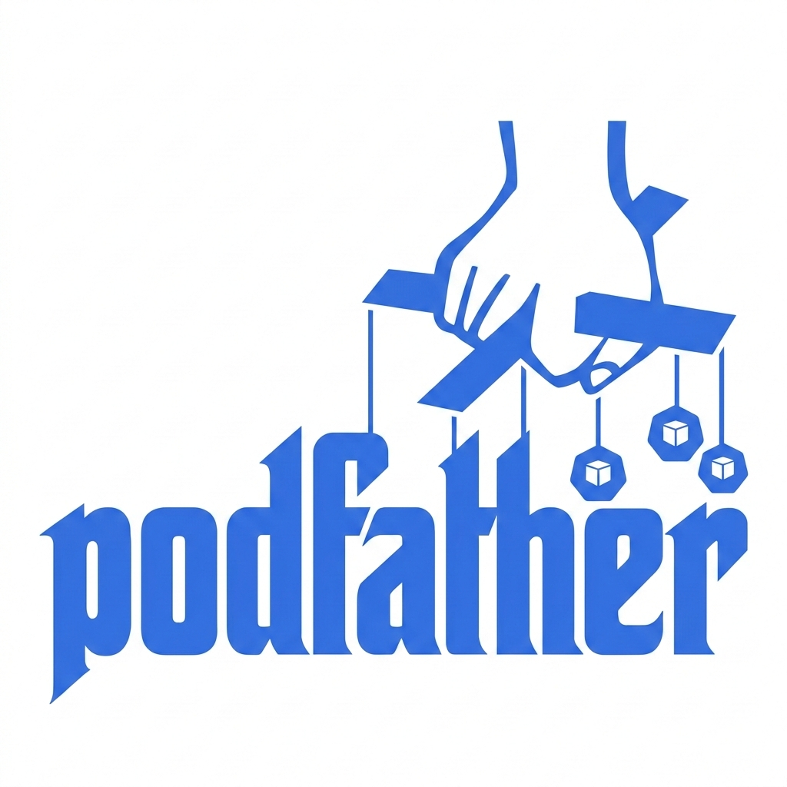

# Podfather



**Podfather** is a Kubernetes Operator that dynamically optimizes pod resource allocation. It watches your pods, collects CPU and memory usage metrics from the Kubernetes Metrics API, and automatically adjusts resource `requests` and `limits` based on actual workload needs — eliminating both over-provisioning (wasted cost) and under-provisioning (throttling and OOMKills).

Built with [Operator SDK](https://sdk.operatorframework.io/) and [controller-runtime](https://github.com/kubernetes-sigs/controller-runtime).

---

## Table of Contents

- [Features](#features)
- [Architecture](#architecture)
  - [Project Structure](#project-structure)
  - [Reconciliation Flow](#reconciliation-flow)
  - [Package Dependency Graph](#package-dependency-graph)
- [Prerequisites](#prerequisites)
- [Quick Start](#quick-start)
  - [Build from Source](#build-from-source)
  - [Run Locally (Outside Cluster)](#run-locally-outside-cluster)
  - [Deploy to a Cluster](#deploy-to-a-cluster)
- [Configuration](#configuration)
  - [PodAutoscaler CRD](#podautoscaler-crd)
  - [Spec Reference](#spec-reference)
  - [Status Reference](#status-reference)
  - [Update Modes](#update-modes)
  - [Command-Line Flags](#command-line-flags)
- [Observability](#observability)
  - [Prometheus Metrics](#prometheus-metrics)
  - [Alerting Rules](#alerting-rules)
  - [Grafana Dashboard](#grafana-dashboard)
  - [OpenTelemetry Tracing](#opentelemetry-tracing)
- [Algorithm Deep Dive](#algorithm-deep-dive)
  - [CPU Calculation](#cpu-calculation)
  - [Memory Calculation](#memory-calculation)
  - [Variance Detection](#variance-detection)
  - [Constraints and Clamping](#constraints-and-clamping)
- [Development Guide](#development-guide)
  - [Prerequisites for Development](#prerequisites-for-development)
  - [Repository Layout](#repository-layout)
  - [Building](#building)
  - [Running Tests](#running-tests)
  - [Adding a New Feature](#adding-a-new-feature)
  - [Code Style and Linting](#code-style-and-linting)
  - [GoDoc](#godoc)
- [Scaffolding History](#scaffolding-history)
- [RBAC Permissions](#rbac-permissions)
- [Roadmap](#roadmap)
- [License](#license)

---

## Features

| Capability | Status |
|---|---|
| Watch pods via label selector and collect metrics | Done |
| Calculate ideal CPU/memory requests and limits | Done |
| In-place vertical pod scaling (KEP-1287) | Done |
| Fallback eviction/recreation with PDB awareness | Done |
| Dry-run mode (recommend without applying) | Done |
| Configurable variance threshold to prevent churn | Done |
| Per-container min/max resource constraints | Done |
| VPA integration (use VPA recommendations when available) | Done |
| Namespace-aware clamping (LimitRange + ResourceQuota) | Done |
| Custom Prometheus metrics (6 metrics) | Done |
| Pre-built Prometheus alerting rules (5 alerts) | Done |
| Grafana dashboard | Done |
| OpenTelemetry distributed tracing | Done |
| Kubernetes Events for every action | Done |
| Finalizer-based cleanup on CR deletion | Done |
| Leader election for HA deployments | Done |
| OLM scorecard integration | Done |
| Seamless CRD upgrades / conversion webhooks | Planned (Phase II) |
| Automated state backup and recovery | Planned (Phase III) |
| Anomaly detection and auto-healing | Planned (Phase V) |

---

## Architecture

### Project Structure

This project was scaffolded with `operator-sdk init` and `operator-sdk create api`.
```
podfather/
├── api/
│   └── v1alpha1/                      # CRD type definitions (operator-sdk generated + customized)
│       ├── groupversion_info.go       # API group registration (operator-sdk scaffold)
│       ├── podautoscaler_types.go     # PodAutoscaler spec, status, and sub-types
│       └── zz_generated.deepcopy.go   # Generated deep-copy methods (make generate)
├── cmd/
│   └── main.go                        # Operator entry point (operator-sdk scaffold + customized)
├── internal/
│   ├── calculator/                    # Pure business logic (no K8s deps)
│   │   ├── calculator.go             # Calculate() function and types
│   │   └── calculator_test.go        # Table-driven unit tests (10 cases)
│   ├── controller/                   # Reconciliation loop (operator-sdk scaffold + full implementation)
│   │   ├── podautoscaler_controller.go
│   │   ├── podautoscaler_controller_test.go  # Controller test scaffold
│   │   └── suite_test.go                     # EnvTest suite (operator-sdk scaffold)
│   ├── metrics/                       # Prometheus metrics + Metrics API collector
│   │   └── metrics.go
│   ├── telemetry/                     # OpenTelemetry initialization
│   │   └── telemetry.go
│   └── updater/                       # Pod update strategies (in-place / eviction)
│       └── updater.go
├── config/                            # Kustomize manifests (operator-sdk generated)
│   ├── crd/                           # CRD YAML (generated by controller-gen)
│   ├── default/                       # Default kustomize overlay
│   ├── manager/                       # Deployment manifest
│   ├── manifests/                     # OLM bundle manifests
│   ├── network-policy/                # Network policy for metrics
│   ├── prometheus/                    # ServiceMonitor + custom alerting rules
│   ├── grafana/                       # Dashboard JSON
│   ├── rbac/                          # RBAC manifests (generated by controller-gen)
│   ├── samples/                       # Example PodAutoscaler CR
│   └── scorecard/                     # OLM scorecard tests
├── hack/                              # Build helpers (operator-sdk scaffold)
├── test/                              # E2E test scaffolding (operator-sdk generated)
├── .devcontainer/                     # Dev container config (operator-sdk generated)
├── .github/                           # GitHub workflows (operator-sdk generated + copilot instructions)
├── Dockerfile                         # Multi-stage distroless image (operator-sdk scaffold)
├── Makefile                           # Build, test, deploy targets (operator-sdk scaffold)
├── PROJECT                            # Operator SDK project metadata
├── go.mod / go.sum                    # Go module dependencies
└── .golangci.yml                      # Linting configuration (operator-sdk scaffold)
```

### Reconciliation Flow

Every reconciliation cycle follows this exact sequence:

```
┌─────────────────────────┐
│ 1. Fetch PodAutoscaler  │  <- Get CR from API server
└──────────┬──────────────┘
           v
┌─────────────────────────┐
│ 2. Finalizer Handling   │  <- Add finalizer on create; cleanup on delete
└──────────┬──────────────┘
           v
┌─────────────────────────┐
│ 3. Discover Pods        │  <- List pods matching label selector
└──────────┬──────────────┘
           v
┌─────────────────────────┐
│ 4. For each pod:        │
│   a. Collect Metrics    │  <- Query Kubernetes Metrics API
│   b. Get Current Alloc  │  <- Read pod.spec.containers[].resources
│   c. Calculate Ideal    │  <- calculator.Calculate()
│   d. Check Variance     │  <- Is deviation > threshold?
└──────────┬──────────────┘
           v
┌─────────────────────────┐
│ 5. Apply Update         │  <- In-place patch or eviction (if not dry-run)
└──────────┬──────────────┘
           v
┌─────────────────────────┐
│ 6. Update CR Status     │  <- Phase, conditions, recommendations, counters
└──────────┬──────────────┘
           v
┌─────────────────────────┐
│ 7. Requeue              │  <- After metricsCollectionIntervalSeconds
└─────────────────────────┘
```

### Package Dependency Graph

```
cmd/main.go
  ├── api/v1alpha1             (CRD types)
  ├── internal/controller
  │     ├── api/v1alpha1
  │     ├── internal/calculator    (pure logic, no K8s deps)
  │     ├── internal/metrics       (Prometheus + Metrics API)
  │     └── internal/updater       (pod mutation strategies)
  ├── internal/metrics             (registered at startup)
  └── internal/telemetry           (OTel init at startup)
```

The **calculator** package has zero Kubernetes dependencies — it only uses the Go standard library (`math`, `fmt`). This is an intentional clean architecture decision that makes the core logic trivially testable.

---

## Prerequisites

| Tool | Version | Purpose |
|---|---|---|
| Go | 1.24+ | Build the operator binary |
| Docker / Podman | Latest | Build container images |
| kubectl | 1.26+ | Interact with the cluster |
| Kubernetes cluster | 1.26+ | Run the operator (1.27+ for in-place scaling) |
| metrics-server | 0.6+ | Provide pod resource metrics |
| operator-sdk | 1.42+ | Scaffolding and OLM integration |

Optional:
- **golangci-lint** — for code linting (config provided in `.golangci.yml`)
- **controller-gen** — auto-downloaded by Makefile when needed
- **kustomize** — auto-downloaded by Makefile when needed
- **OpenTelemetry Collector** — for distributed tracing

---

## Quick Start

### Build from Source

```bash
# Clone the repository
git clone https://github.com/des57/podfather.git
cd podfather

# Download dependencies
go mod tidy

# Build the binary
make build
# Output: bin/manager

# Run tests
make test
```

### Run Locally (Outside Cluster)

Running locally is the fastest way to develop and debug. The operator connects to whatever cluster your `~/.kube/config` points to.

```bash
# 1. Ensure metrics-server is running in your cluster
kubectl get pods -n kube-system | grep metrics-server

# 2. Install the CRD
make install

# 3. Run the operator locally
make run

# 4. In another terminal, create a sample PodAutoscaler
kubectl apply -f config/samples/autoscaling_v1alpha1_podautoscaler.yaml

# 5. Watch the operator logs for reconciliation activity

# 6. Clean up
kubectl delete -f config/samples/autoscaling_v1alpha1_podautoscaler.yaml
make uninstall
```

### Deploy to a Cluster

```bash
# 1. Build and push the container image
export IMG=your-registry.com/podfather:v0.1.0
make docker-build docker-push IMG=$IMG

# 2. Deploy the operator (CRD + RBAC + Deployment)
make deploy IMG=$IMG

# 3. Verify the operator is running
kubectl get pods -n podfather-system

# 4. Create a PodAutoscaler for your workload
kubectl apply -f config/samples/autoscaling_v1alpha1_podautoscaler.yaml

# 5. Check status
kubectl get podautoscalers  # or: kubectl get pa
kubectl describe podautoscaler podautoscaler-sample
```

---

## Configuration

### PodAutoscaler CRD

The `PodAutoscaler` Custom Resource is how you tell Podfather what to optimize. Create one per workload (Deployment, StatefulSet, etc.).

```yaml
apiVersion: autoscaling.podfather.io/v1alpha1
kind: PodAutoscaler
metadata:
  name: my-app
  namespace: default
spec:
  # Required: which pods to manage
  selector:
    matchLabels:
      app: my-app

  # Optional: reference to the owning workload (informational)
  targetRef:
    kind: Deployment
    name: my-app
    apiVersion: apps/v1

  # Optional: resource boundaries per container
  resourcePolicy:
    containerPolicies:
      - containerName: "*"          # applies to all containers
        minAllowed:
          cpu: "50m"
          memory: "64Mi"
        maxAllowed:
          cpu: "4"
          memory: "8Gi"
        controlledResources:
          - cpu
          - memory

  # Optional: how to apply changes
  updatePolicy:
    updateMode: Auto              # Auto | InPlace | Recreate | Off
    maxUnavailable: 1

  # Optional: tuning
  metricsCollectionIntervalSeconds: 30   # how often to reconcile (min: 10)
  evaluationWindowMinutes: 5             # metrics evaluation window (min: 1)
  varianceThresholdPercent: 15           # minimum deviation to trigger update (1-100)
  dryRun: false                          # true = recommend only, never mutate
```

### Spec Reference

| Field | Type | Default | Description |
|---|---|---|---|
| `selector` | `LabelSelector` | *required* | Label selector to identify managed pods |
| `targetRef` | `CrossVersionObjectReference` | — | Reference to the owning workload controller |
| `resourcePolicy` | `ResourcePolicy` | — | Per-container min/max resource boundaries |
| `updatePolicy.updateMode` | `string` | `Auto` | Update strategy: `Auto`, `InPlace`, `Recreate`, `Off` |
| `updatePolicy.maxUnavailable` | `int32` | `1` | Max pods unavailable during updates |
| `metricsCollectionIntervalSeconds` | `int32` | `30` | Reconciliation interval in seconds |
| `evaluationWindowMinutes` | `int32` | `5` | Time window for metrics aggregation |
| `varianceThresholdPercent` | `int32` | `15` | Minimum % deviation to trigger an update |
| `dryRun` | `bool` | `false` | If true, calculate but never apply changes |

### Status Reference

| Field | Type | Description |
|---|---|---|
| `phase` | `string` | `Pending`, `Active`, `Degraded`, or `Error` |
| `conditions` | `[]Condition` | Kubernetes-standard conditions (`Ready`, `MetricsAvailable`) |
| `monitoredPods` | `int32` | Number of running pods currently being watched |
| `recommendation` | `Recommendation` | Latest computed resource recommendations per container |
| `lastEvaluationTime` | `Time` | When metrics were last evaluated |
| `lastUpdateTime` | `Time` | When resources were last updated on pods |
| `totalAdjustments` | `int64` | Cumulative number of resource adjustments |
| `observedGeneration` | `int64` | Last observed spec generation |

### Update Modes

| Mode | Behavior |
|---|---|
| **Auto** | Try in-place vertical scaling first (Kubernetes 1.27+, KEP-1287). If unsupported or the patch fails, fall back to eviction. **Recommended for most users.** |
| **InPlace** | Only attempt in-place scaling. Fail with an error if the cluster doesn't support it. |
| **Recreate** | Always evict the pod and let the owning controller recreate it. Safest option for older clusters. |
| **Off** | Never mutate pods. The controller still collects metrics and writes recommendations to status. |

### Command-Line Flags

| Flag | Default | Description |
|---|---|---|
| `--metrics-bind-address` | `0` (disabled) | Address for Prometheus metrics endpoint (use `:8443` for HTTPS or `:8080` for HTTP) |
| `--health-probe-bind-address` | `:8081` | Address for `/healthz` and `/readyz` probes |
| `--leader-elect` | `false` | Enable leader election for HA |
| `--metrics-secure` | `true` | Serve metrics via HTTPS (with authn/authz) |
| `--otel-endpoint` | `""` | OTLP gRPC endpoint (e.g., `localhost:4317`) |
| `--enable-http2` | `false` | Enable HTTP/2 for metrics/webhook servers |

---

## Observability

### Prometheus Metrics

All metrics are exposed on the metrics endpoint.

| Metric | Type | Labels | Description |
|---|---|---|---|
| `podfather_pods_monitored` | Gauge | — | Pods currently monitored |
| `podfather_resource_adjustments_total` | Counter | namespace, pod, container, resource | Resource adjustments made |
| `podfather_metrics_collection_errors_total` | Counter | — | Metrics collection failures |
| `podfather_evaluation_duration_seconds` | Histogram | — | Time per evaluation cycle |
| `podfather_pod_starvation_events_total` | Counter | namespace, pod | Starvation events detected |
| `podfather_recommendation_variance_percent` | Histogram | resource | Variance distribution |

### Alerting Rules

Pre-built Prometheus alerting rules are in `config/prometheus/alerts.yaml`:

| Alert | Severity | Fires When |
|---|---|---|
| `PodStarvationDetected` | critical | Starvation events detected for > 2 minutes |
| `HighMetricsCollectionErrors` | warning | Error rate > 0.1/s for > 5 minutes |
| `NoPodsMonitored` | warning | Zero pods monitored for > 10 minutes |
| `HighRecommendationVariance` | warning | P95 variance > 100% for > 5 minutes |
| `SlowEvaluationCycle` | warning | P99 evaluation > 30 seconds for > 5 minutes |

### Grafana Dashboard

Import `config/grafana/dashboard.json` into Grafana for a visual overview with 8 panels:

- Pods Monitored, Total Adjustments, Collection Errors, Starvation Events (top row stats)
- Adjustments Rate per Minute (time series)
- Evaluation Duration percentiles (time series)
- Recommendation Variance Distribution (histogram)
- Adjustments by Namespace/Pod (table)

### OpenTelemetry Tracing

Start the operator with `--otel-endpoint` to send traces to any OTLP-compatible collector:

```bash
./bin/manager --otel-endpoint=localhost:4317
```

Every reconciliation cycle creates spans for observability.

---

## Algorithm Deep Dive

The core resource calculation logic lives in `internal/calculator/calculator.go` and has **zero Kubernetes dependencies**.

### CPU Calculation

```
cpuBase    = max(averageUsage, peakUsage * 0.8)
cpuRequest = cpuBase * (1 + 20/100)
cpuRequest = clamp(cpuRequest, minCPU, maxCPU)
cpuLimit   = cpuRequest * 1.5
cpuLimit   = clamp(cpuLimit, minCPU, maxCPU)
```

**Why 80% peak dampening?** Bursty workloads can have extreme but brief spikes. Using 80% of the peak prevents over-provisioning for momentary spikes while still providing headroom.

### Memory Calculation

```
memBase    = max(averageUsage, peakUsage * 0.9)
memRequest = memBase * (1 + 25/100)
memRequest = clamp(memRequest, minMemory, maxMemory)
memLimit   = memRequest * 1.5
memLimit   = clamp(memLimit, minMemory, maxMemory)
```

**Why 90% peak dampening?** Memory is inelastic — exceeding the limit causes OOMKill, which is far more disruptive than CPU throttling.

### Variance Detection

```
cpuVariance = |recommendedCPU - currentCPU| / currentCPU * 100
memVariance = |recommendedMem - currentMem| / currentMem * 100

significantVariance = (cpuVariance >= threshold) OR (memVariance >= threshold)
```

If current allocation is zero, variance is treated as 100%. Default threshold is **15%**.

### Constraints and Clamping

| Constraint | Default | Purpose |
|---|---|---|
| MinCPUCores | 0.01 (10m) | Prevent setting CPU so low the container can't start |
| MaxCPUCores | 16.0 | Prevent runaway allocation |
| MinMemoryBytes | 16 MiB | Minimum viable memory |
| MaxMemoryBytes | 64 GiB | Upper bound |

### VPA Integration

Podfather can optionally integrate with the [Kubernetes Vertical Pod Autoscaler (VPA)](https://github.com/kubernetes/autoscaler/tree/master/vertical-pod-autoscaler). When enabled via `spec.vpaPolicy`, Podfather:

1. **Detects VPA CRDs** — checks whether VPA is installed in the cluster at reconciliation time.
2. **Discovers matching VPAs** — finds VPA objects targeting the same workload (matched by `targetRef` kind and name).
3. **Uses VPA recommendations** — if a matching VPA is found and is in `"Off"` mode (recommendation-only), Podfather uses VPA's container recommendations instead of its own algorithm.
4. **Conflict detection** — if a matching VPA is found but is NOT in `"Off"` mode, Podfather detects the conflict:
   - In **strict mode** (`vpaPolicy.strictMode: true`): refuses to act and emits a warning event.
   - In **default mode**: logs a warning and falls back to its own algorithm.

**Configuration example:**

```yaml
spec:
  vpaPolicy:
    enabled: true          # look for VPA resources (default: true)
    vpaName: ""            # optional: explicit VPA name; empty = auto-discover by targetRef
    strictMode: false      # true = refuse to act if VPA is not in "Off" mode
```

VPA integration state is reported in `.status.vpaStatus`:

| Field | Description |
|---|---|
| `vpaInstalled` | Whether VPA CRDs are present in the cluster |
| `matchingVPAName` | Name of the matching VPA object (empty if none) |
| `vpaUpdateMode` | The update mode of the matched VPA |
| `usingVPARecommendations` | True when actively using VPA recommendations |
| `vpaConflict` | Describes any detected conflict with VPA |

### Namespace-Aware Resource Clamping (LimitRange & ResourceQuota)

Podfather automatically detects and respects **LimitRange** and **ResourceQuota** objects in the namespace where managed pods run. This prevents the operator from recommending resource values that the Kubernetes API server would reject.

#### How It Works

1. **LimitRange enforcement** — Before applying recommendations, Podfather reads all `LimitRange` objects in the namespace and extracts:
   - Per-container min/max CPU and memory (`type: Container`)
   - Per-pod max CPU and memory (`type: Pod`)
   - Default requests and limits
   - `maxLimitRequestRatio` constraints

2. **ResourceQuota awareness** — Podfather reads `ResourceQuota` objects and computes remaining headroom (`hard - used`) for CPU and memory requests. Recommendations are capped to the available quota so that pod updates are not rejected.

3. **Clamping** — All calculator outputs are clamped to the tightest intersection of:
   - The user-configured `resourcePolicy` from the PodAutoscaler CR
   - The LimitRange container/pod bounds
   - The ResourceQuota remaining headroom

4. **Transparency** — Any adjustments made due to namespace constraints are logged and reported in `.status.namespaceConstraints`:

| Field | Description |
|---|---|
| `limitRangeFound` | Whether at least one LimitRange exists |
| `resourceQuotaFound` | Whether at least one ResourceQuota exists |
| `effectiveMinCPU` | Effective minimum CPU from LimitRange |
| `effectiveMaxCPU` | Effective maximum CPU from LimitRange |
| `effectiveMinMemory` | Effective minimum memory from LimitRange |
| `effectiveMaxMemory` | Effective maximum memory from LimitRange |
| `clampReasons` | Human-readable descriptions of any clamping adjustments |

---

## Development Guide

### Prerequisites for Development

```bash
go version       # 1.24+
operator-sdk version  # 1.42+ (used to scaffold the project)
```

### Repository Layout

| Directory | Contains | K8s Dependencies |
|---|---|---|
| `api/v1alpha1/` | CRD Go types | Yes |
| `internal/calculator/` | Resource calculation logic | **No** (pure Go) |
| `internal/metrics/` | Prometheus + Metrics API client | Yes |
| `internal/updater/` | Pod mutation strategies | Yes |
| `internal/telemetry/` | OpenTelemetry setup | No (OTEL SDK only) |
| `internal/vpa/` | VPA detection & recommendation parsing | Yes |
| `internal/namespacelimits/` | LimitRange & ResourceQuota clamping | Yes |
| `internal/controller/` | Reconciliation loop | Yes |
| `cmd/` | Entry point | Yes |
| `config/` | Kustomize manifests | N/A (YAML) |
| `test/` | E2E tests | Yes |

### Building

```bash
make build          # Build bin/manager
make docker-build   # Build container image
make manifests      # Regenerate CRD + RBAC YAML
make generate       # Regenerate DeepCopy methods
make fmt            # Format code
make vet            # Run go vet
```

### Running Tests

```bash
# Run all tests
make test

# Run just the calculator tests (fast, no K8s deps)
go test ./internal/calculator/... -v

# Run with race detector
go test -race ./...

# Run OLM scorecard tests
operator-sdk scorecard bundle
```

### Adding a New Feature

1. **Business logic** — Add it to `internal/calculator/` if it's a pure calculation. Write table-driven tests first.
2. **Kubernetes interaction** — Add it to the appropriate `internal/` package.
3. **Wire it up** in `internal/controller/podautoscaler_controller.go`.
4. **CRD changes** — If you add new spec/status fields:
   - Edit `api/v1alpha1/podautoscaler_types.go`
   - Run `make generate` to regenerate DeepCopy
   - Run `make manifests` to regenerate CRD YAML
5. **RBAC changes** — Add `+kubebuilder:rbac` markers to the controller; run `make manifests`.

### Code Style and Linting

```bash
make lint              # Uses .golangci.yml config
gofmt -w .             # Format all Go files
```

The project ships with `.golangci.yml` (generated by operator-sdk) for consistent linting.

### GoDoc

All exported types, functions, and packages have GoDoc comments.

```bash
go install golang.org/x/tools/cmd/godoc@latest
godoc -http=:6060
# Open http://localhost:6060/pkg/github.com/des57/podfather/
```

---

## Scaffolding History

This project was bootstrapped using the Operator SDK CLI:

```bash
# 1. Initialize the project
operator-sdk init \
  --domain podfather.io \
  --repo github.com/des57/podfather \
  --project-name podfather \
  --owner "Podfather Contributors"

# 2. Create the PodAutoscaler API + controller
operator-sdk create api \
  --group autoscaling \
  --version v1alpha1 \
  --kind PodAutoscaler \
  --resource --controller
```

The scaffolded files (PROJECT, Makefile, Dockerfile, config/*, test/*, .github/workflows/*, .devcontainer/, hack/, .golangci.yml) are preserved from operator-sdk v1.42.0. Custom Podfather business logic was then implemented on top of the generated scaffold.

---

## RBAC Permissions

The operator requires these cluster-level permissions (generated by controller-gen from `+kubebuilder:rbac` markers):

| API Group | Resource | Verbs | Reason |
|---|---|---|---|
| `autoscaling.podfather.io` | `podautoscalers` | get, list, watch, create, update, patch, delete | Manage the CR |
| `autoscaling.podfather.io` | `podautoscalers/status` | get, update, patch | Update CR status |
| `autoscaling.podfather.io` | `podautoscalers/finalizers` | update | Manage finalizers |
| `""` (core) | `pods` | get, list, watch, update, patch, delete | Monitor and update pods |
| `""` (core) | `events` | create, patch | Emit Kubernetes Events |
| `""` (core) | `limitranges` | get, list, watch | Read namespace LimitRange constraints |
| `""` (core) | `resourcequotas` | get, list, watch | Read namespace ResourceQuota constraints |
| `metrics.k8s.io` | `pods` | get, list | Read pod resource metrics |
| `autoscaling.k8s.io` | `verticalpodautoscalers` | get, list, watch | VPA integration |
| `coordination.k8s.io` | `leases` | get, list, watch, create, update, patch, delete | Leader election |

Additional RBAC for metrics authentication is in `config/rbac/metrics_auth_role.yaml`.

---

## Roadmap

| Phase | Capability | Status |
|---|---|---|
| I | Basic Install (Operator SDK, OLM, Helm) | Done |
| II | Seamless Upgrades (CRD versioning, conversion webhooks) | Planned |
| III | Full Lifecycle (automated backup/recovery) | Planned |
| IV | Deep Insights (OpenTelemetry, Prometheus, Grafana) | Done |
| V | Auto Pilot (anomaly detection, auto-healing) | Planned |

---

## License

Copyright 2026 Podfather Contributors.

Licensed under the Apache License, Version 2.0. See the [LICENSE](LICENSE) file for details.

